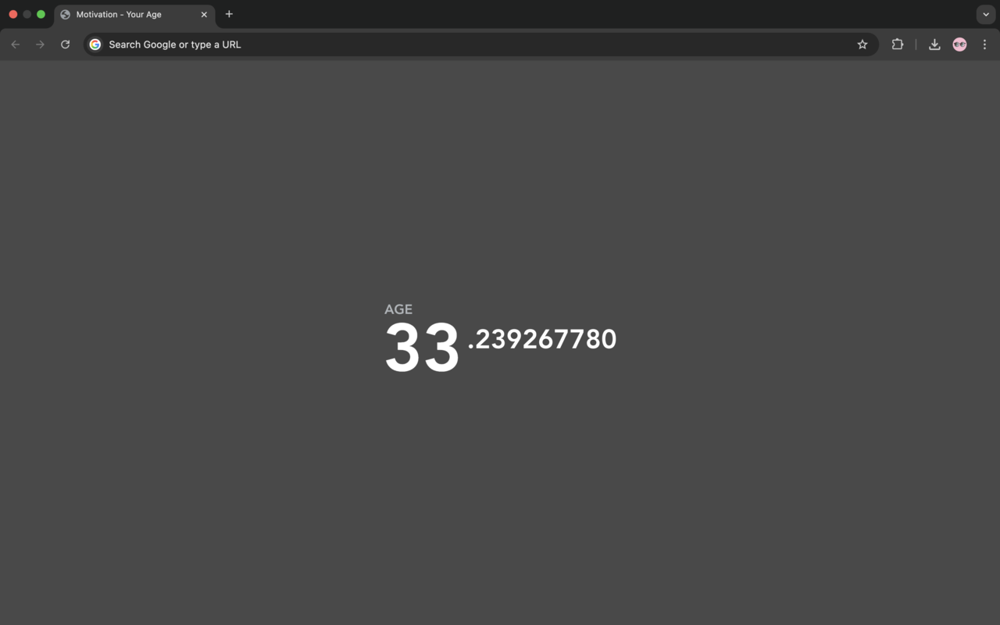
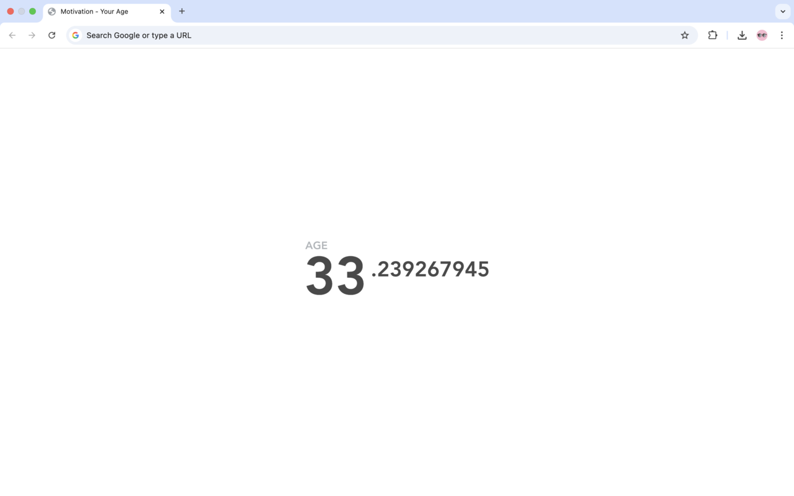

# Motivation - Age Counter Extension

A modernized version of Alex MacCaw's iconic "Motivation" Chrome extension, updated to work with current browser standards.

## 🙏 Credits & Attribution

**This extension is entirely based on the original work by [Alex MacCaw](https://github.com/maccman).**

The original "Motivation" extension was created in 2013 and became beloved by thousands of users for its simple yet profound concept. This version exists solely to preserve that experience for users who want to continue using this meaningful tool as Chrome's extension platform has evolved.

**All credit for the concept, design, and original implementation belongs to Alex MacCaw.**

## 📝 Purpose of This Version

This modernized implementation serves only to:
- Keep the original extension functional on modern Chrome browsers
- Maintain the exact same user experience and visual design
- Ensure privacy compliance with current web standards
- Provide continued access to this valuable tool for existing users

**This is a non-commercial, community preservation effort.** We make no claims to originality or ownership of the concept.

## ✨ What It Does

Just like the original:
- Replaces your new tab page with a real-time display of your age
- Shows your age with precision down to milliseconds
- Clean, minimalist design that serves as a gentle reminder of time's passage
- Completely private - your birth date stays in your browser

## 🔒 Privacy & Technical Updates

While maintaining the original experience, this version includes:
- **Updated for Manifest V3** - Compatible with current Chrome requirements
- **Enhanced privacy** - No data collection, analytics, or external connections
- **Modern security standards** - Built with current web security practices
- **Offline functionality** - Works without internet connection

## 📥 Installation

### From Chrome Web Store
1. Visit the Chrome Web Store page
2. Click "Add to Chrome"
3. Enter your birth date when prompted

### Manual Installation
1. Download this repository
2. Open Chrome and go to `chrome://extensions/`
3. Enable "Developer mode"
4. Click "Load unpacked" and select the extension folder

## 🛠️ Technical Details

- **Original concept**: Alex MacCaw (2013)
- **Modern implementation**: Updated for Manifest V3 compatibility
- **Storage**: Local browser storage only
- **Permissions**: None required
- **Dependencies**: Vanilla JavaScript, no external libraries

## 📞 Contact & Support

If you encounter issues with this modernized version, please [create an issue](https://github.com/1gory/motivation-extension/issues).

**For questions about the original concept or to contact the original author, please visit [Alex MacCaw's GitHub](https://github.com/maccman).**

## ⚖️ Legal & Disclaimer

This project is a technical modernization of Alex MacCaw's original work, created solely for the benefit of users who wish to continue using this extension. We claim no ownership of the original concept, design, or intellectual property.

If you are Alex MacCaw or represent his interests and have any concerns about this project, please contact us immediately and we will address them promptly.

## 📄 License

This modernized implementation is provided under the MIT License for the technical updates only. All rights to the original concept and design remain with Alex MacCaw.

---

*Made with respect and gratitude for Alex MacCaw's original vision.*
